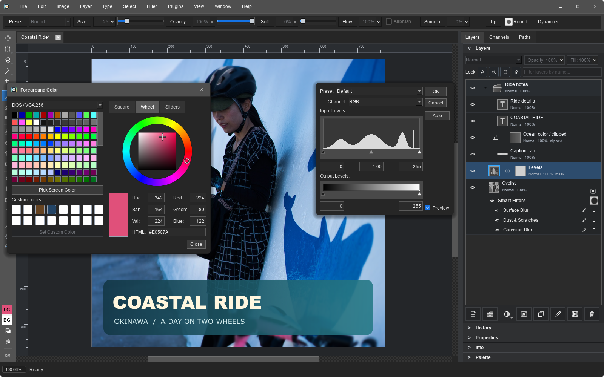
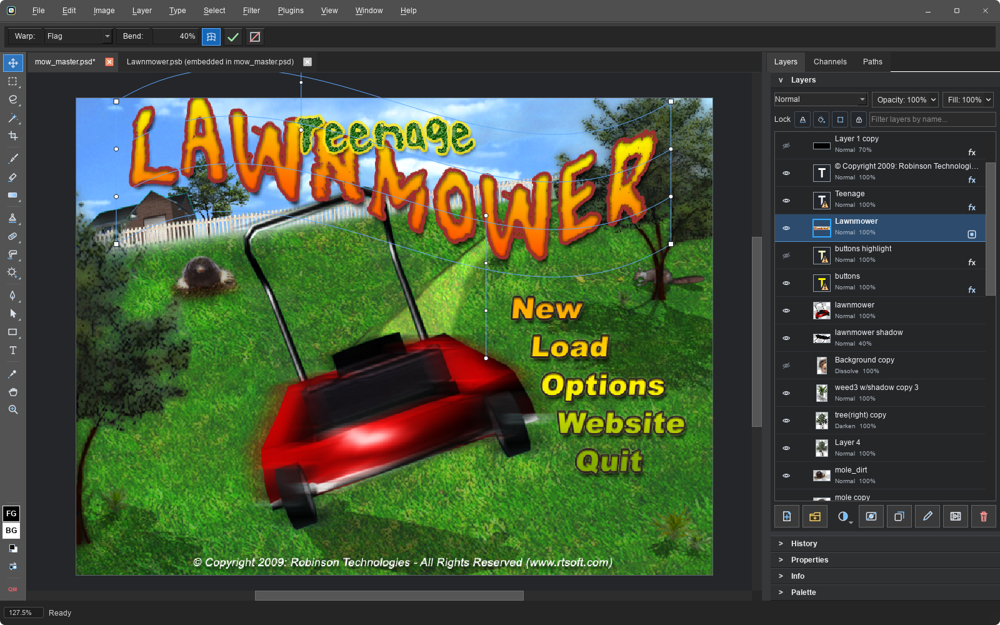
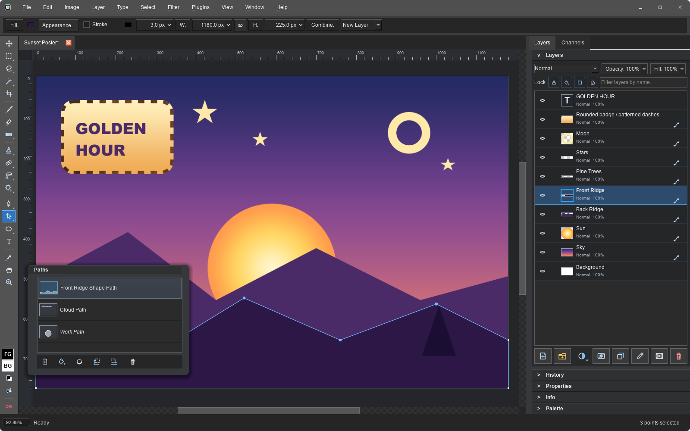
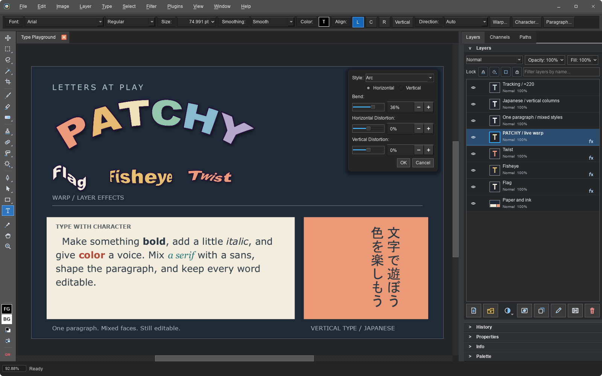
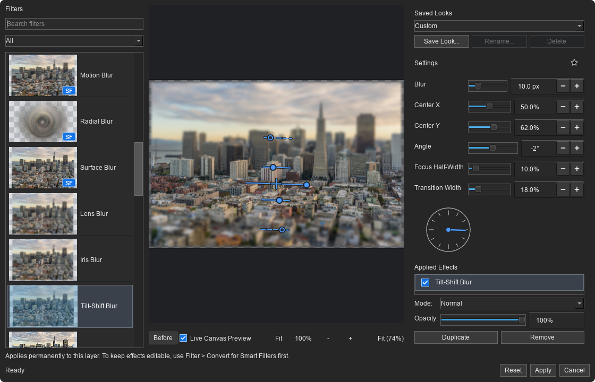

# Patchy Image Editor

A free, open-source image editor for Windows, macOS, Linux, and the browser.
Built with a focus on accurate PSD compatibility, keeping text, vectors, masks,
layer styles, and Smart Objects editable when working with layered Photoshop files.

**[Download](#download)** · **[Try in your browser](https://www.patchyimageeditor.com)** · **[Features](#features)** · **[Full gallery](docs/screenshots.md)**

For bug reports and feature requests, please [open an issue](https://github.com/SethRobinson/Patchy/issues/new) or post in [Discussions](https://github.com/SethRobinson/Patchy/discussions). These are the best places to post because search engines can index them, helping others find the questions and answers.  Want to chat? Join [Seth's Discord](https://discord.gg/QwV5VaZ).

<a href="docs/images/screenshots/smart_filters.png"></a>

*Designed to feel familiar if you're used to Photoshop's workflows and keyboard shortcuts.*

## Download

**Latest release: 1.02** · October 1, 2026 · [Release notes](#whats-new) · [All releases](https://github.com/SethRobinson/Patchy/releases)

Windows releases are code signed by Seth A. Robinson; the macOS app is signed and
notarized (Robinson Technologies Corporation). Every release is published on the
[GitHub Releases page](https://github.com/SethRobinson/Patchy/releases) with SHA-256
checksums, and mirrored at rtsoft.com.

| Platform                  | Package                     | Download                                                                                                                |
| ------------------------- | --------------------------- | ----------------------------------------------------------------------------------------------------------------------- |
| Windows 10/11 (64-bit)    | Installer                   | [PatchyWindowsInstaller.exe](https://github.com/SethRobinson/Patchy/releases/latest/download/PatchyWindowsInstaller.exe) (59 MB)     |
| Windows 10/11 (64-bit)    | Portable ZIP (no installer) | [PatchyWindowsNoInstaller.zip](https://github.com/SethRobinson/Patchy/releases/latest/download/PatchyWindowsNoInstaller.zip) (59 MB) |
| macOS 12+ (Apple Silicon) | DMG - drag to Applications  | [PatchyMacOS.dmg](https://github.com/SethRobinson/Patchy/releases/latest/download/PatchyMacOS.dmg) (64 MB)                           |
| Linux                     | Flatpak bundle              | [PatchyLinux.flatpak](https://github.com/SethRobinson/Patchy/releases/latest/download/PatchyLinux.flatpak) (31 MB)                   |
| Any modern browser        | Nothing to install          | [patchyimageeditor.com](https://www.patchyimageeditor.com) or [rtsoft.com/patchy](https://www.rtsoft.com/patchy/)                    |

Mirror: the same files are also at [rtsoft.com/files](https://rtsoft.com/files/PatchyWindowsInstaller.exe)
(`PatchyWindowsInstaller.exe`, `PatchyWindowsNoInstaller.zip`, `PatchyMacOS.dmg`, `PatchyLinux.flatpak`).

Linux one-line install (paste into a terminal; fetches the bundle and installs it for
your user, pulling the shared KDE runtime from Flathub automatically, no root needed):

```sh
curl -L -o /tmp/PatchyLinux.flatpak https://github.com/SethRobinson/Patchy/releases/latest/download/PatchyLinux.flatpak && flatpak install --user -y /tmp/PatchyLinux.flatpak
```

Optional: opening iPhone HEIC photos on Linux uses the shared Freedesktop codec
extension, which bundle installs do not fetch on their own. Patchy will show this
command if it is needed:

```sh
flatpak install --user -y flathub org.freedesktop.Platform.ffmpeg-full//24.08
```

## Screenshots

See it in action.  Click an image for the full-size capture.

<table>
  <tr>
    <td valign="top" width="50%"><a href="docs/images/screenshots/layer_styles.png"></a><br><strong>Build up layer effects</strong><br>Layer styles with multiple effects, blending controls, and Photoshop-compatible presets.</td>
    <td valign="top" width="50%"><a href="docs/images/screenshots/plugin_kpt5.png"></a><br><strong>Bring your old plug-ins</strong><br>Kai's Power Tools 5 running in its own window over Patchy. Classic 32-bit and 64-bit 8BF filters work on Windows.</td>
  </tr>
  <tr>
    <td valign="top" width="50%"><a href="docs/images/screenshots/smart_objects.png"></a><br><strong>Keep the original editable</strong><br>Warp a Smart Object while its embedded source stays available in another tab.</td>
    <td valign="top" width="50%"><a href="docs/images/screenshots/vector_tools.png"></a><br><strong>Edit the paths</strong><br>Editable paths, gradient and pattern paint, dashed strokes, rounded corners, and a Paths panel.</td>
  </tr>
  <tr>
    <td valign="top" width="50%"><a href="docs/images/screenshots/warp_text.png"></a><br><strong>Give type its own voice</strong><br>Warped text, mixed fonts and styles in one paragraph, letter spacing, and vertical Japanese. All editable.</td>
    <td valign="top" width="50%"><a href="docs/images/screenshots/tilt_shift.png"></a><br><strong>Shape the focus</strong><br>Tilt-Shift Blur with on-image controls and live preview in the Filter Gallery.</td>
  </tr>
</table>

[See the full gallery](docs/screenshots.md) for painting, palette mode, seamless textures,
Camera Raw, long shadows, scripting, and more.

## Features

| Workflow | What you get |
| --- | --- |
| **Layered Photoshop files** | PSD and PSB, editable text, groups, masks, clipping, blend modes, and layer styles. |
| **Non-destructive editing** | Adjustment layers, embedded and linked Smart Objects, editable Smart Filters, and shared filter masks. |
| **Paint and retouch** | Pressure-aware brushes, Mixer Brush, stroke smoothing, healing, cloning, Patch, Remove Object, selections, and Liquify. |
| **Text and vectors** | Rich and vertical text, paragraph controls, Warp Text, Pen paths, shape layers, vector masks, SVG, and image tracing. |
| **PDF documents** | Import pages as editable text, vectors, and images on desktop; export single or multi-page PDFs with editable or flattened content. |
| **Photos and other formats** | Camera Raw development, HEIC/HEIF photos, layered Affinity import, and common image formats. |
| **Pixel art and game assets** | Named palettes, indexed export, seamless tiling, sprite sheets, image sequences, and animated GIFs. |
| **Extend your workflow** | Legacy Photoshop filters on Windows, JavaScript scripts, batch processing, command-line tools, and local MCP control. |

[Full feature list and format support](docs/features.md) · [Scripting guide](scripts/bundled/scripting-guide.md) · [AI control setup](docs/ai-control.md)

**Local by design.** No telemetry, tracking, or uploads of your images. The browser build
runs the same editor locally through WebAssembly. Desktop builds have more memory
available and add printing, scanner/camera import, and command-line automation.
Optional update checks contact GitHub. Eight interface languages, dark and light
schemes, and importable themes are included.

## PSD compatibility, measured

In the August 7, 2026 Testy run, Photoshop reopened **all 64 Patchy saves**, and
**all 312 text objects stayed editable**. Patchy's perceptual render match was
**98.83% across 63 measured files**, using commit `879a3a8`.

These are dated, corpus-specific results. Read the [full comparison and methodology](docs/psd-compatibility-benchmark.md)
for tested versions, per-file results, preservation checks, and limitations.

**Know the limits:** editing is RGB/RGBA 8-bit; there is no GPU acceleration or
CMYK/Lab/16-bit/32-bit editing. Unsupported Smart Filters can remain preview-locked,
and Affinity import has format-specific limitations. See [current compatibility](docs/features.md#current-status).

## What's New

### 1.02 - October 1, 2026

- New logo and app icon
- Place Linked: File > Place Linked adds a Smart Object that points at a file on disk instead of embedding it (SVGs stay sharp at any size), and Image Size, Free Transform and Warp re-render linked Smart Objects from their files
- Zoom tool: Scrubby Zoom (drag left or right to zoom, issue 51), plus Zoom In/Out, 100%, Fit Screen and Fill Screen buttons in the options bar
- Trackpad two-finger scroll pans the canvas in any direction, and the mouse wheel zooms by default on macOS (issue 44)
- Canvas Size: a link button to constrain proportions, an option to delete layers left completely off the canvas, and a new Image > Crop to Selection (Advanced) that opens it prefilled with the selection
- Dimension fields follow the ruler unit, and New Document, Image Size and Canvas Size remember the unit you picked (issue 53)
- Preferences has a new Tools tab for the mouse wheel and transform options
- A document with only one layer no longer makes you click the layer first; commands and tools just use it
- Opening a 16 or 32-bit PSD always shows the Import Notes popup so the conversion to 8-bit is not a surprise (issue 52)
- Legacy plug-ins: a slow filter shows that Patchy is waiting on it instead of looking frozen
- Lasso, Stroke and Liquify no longer stall on very fragmented selections
- Layers panel: double-clicking a shape layer's vector badge opens Shape Appearance
- SVG import: gradients and patterns follow the element's transforms. SVG save only warns about flattening when something really gets rasterized, and editable PDF export rotates pattern fills the right way
- Convert to Smart Object no longer shifts a linked layer mask twice
- macOS: resizing the brush and the eyedropper no longer raise permission prompts
- Scripting/MCP improvements: `doc.addSmartObject`, `getSmartObject` and `updateSmartObject`, and layer moves carry text, shape, Smart Object and mask placement along

### 1.01 - September 29, 2026

- UI themes! Dark, Light, seven bundled ones (Solarized, Nord, Dracula, Gruvbox and more) or make your own with a small `.patchytheme` file. Big thanks to [@lucastucious](https://github.com/lucastucious) for the theme system
- Classic Photoshop .8bf filter plug-ins now run on Windows, 32-bit and 64-bit (Filter Foundry, Mehdi's filters, even Kai's Power Tools 5 works). Drop them in the plug-ins folder and they show up in the new Plugins menu
- Scrubby labels: drag the label next to any number field to change its value, like Photoshop (issue 46)
- Right-click the gray area around the canvas to change its color (issue 47)
- Shift+letter cycles through a tool flyout, so Shift+M flips between the marquee tools and so on (issue 45)
- Canvas Size uses real units now
- Photoshop 5.x era text layers open as editable text instead of pixels
- Grayscale PSDs open as RGB instead of coming out garbled (issue 39)
- Duplicate Layer puts the copy directly above the original (issue 38)
- Layer effects on a clipping base draw over the clipped layers, the way Photoshop does it (issue 41), and size 0 Inner Shadow and Inner Glow render like Photoshop too
- Size sliders spend most of the track on the small values, so tiny brushes are easier to hit
- Better font matching for PSD text (fonts are looked up by their real names), and user-added fonts work on the Mac under their Windows names
- macOS: quitting no longer freezes when a network drive or a DNS lookup is stuck (issue 48)
- Progress dialogs always pop up centered on the window

[Older releases](RELEASE-HISTORY.md)

## Photoshop plug-ins (.8bf, Windows only)

Choose **Plugins > Open Plug-ins Folder**, copy your `.8bf` files and their supporting
files into it, then choose **Plugins > Rescan Plug-in Folders**. Both 32-bit and 64-bit
filters appear under **Plugins > Legacy Photoshop Plug-ins**.

Filters run on the active pixel layer, respect the selection, and apply as one undoable
step. A separate helper isolates plug-in crashes. Plug-ins still run with your user
permissions, so install only ones you trust. KPT and other formerly full-screen filters
get a bounded, movable window. [Plug-in details](docs/plugins.md).

## Building it yourself

See [build instructions](docs/building.md) for the core, Qt desktop app, macOS, Linux,
and Windows packaging. Contributors and automation tools should read [AGENTS.md](AGENTS.md) first.

## License

Patchy is released under the MIT License. Third-party runtime notices are tracked in `NOTICE-THIRD-PARTY.md`.

## Trademark Notice

Adobe and Photoshop are either registered trademarks or trademarks of Adobe in the United States and/or other countries. Patchy is an independent project and is not authorized, endorsed, or sponsored by Adobe. References to Photoshop, its file formats (PSD, Smart Objects, Smart Filters) and its plug-in format (8BF) are only there to describe compatibility.

## AI Disclosure

This project was developed with significant assistance from AI tools.  I mean, you can still blame me (Seth) for bugs, but I just wanted to mention it.

Note:  All included textures/materials are real images taken by humans, not AI generated

## Missing features / contributions?

AI has reached the point where you can use your favorite AI to add the missing feature you want.

Just give it the link to this repo and say "Add .tiff support" and in about 10 minutes it will be done and working on your computer.  Amazing, right?

I mean, that's kind of the power of open source.

Whatever AI you use, tell it (or more likely, it's reading this right now) to read AGENTS.md before doing anything else. It contains the build and repository-wide rules, then routes feature work to the relevant document under `docs/`.

There are 2200+ regression and benchmarking tests. AGENTS.md links agents to the testing guide that explains how to select and run them.  Due to the size of some of the test files I use they aren't all included, it will skip tests that require missing files.\
\
I probably don't want any major features coming from outside, as there are wrong and right ways to do things, some of it a bit subjective. Remember, you can always go crazy in your own fork, have some fun!\
\
If you have a bug fix or feature you think fits this project's scope please open an issue or tweet/etc at me.  If you want to submit a pull request, please look at the actual code and fully TEST IT YOURSELF before submitting, and if possible include screenshots of the actual changes so it's clear what you're doing.  If you're using AI, use a good one (Fable/Astra+ class), we don't want barely working slop.

Don't trust AI to create and submit PRs with no oversight, I'll delete ones that have too much AI smell.  Smell human.  This is starting to sound weird but you know what I mean.\
\
Also, note that certain features are crippled or not included due to Adobe patents.  For example, our "quick select" tool doesn't update in realtime, you have to finish the stroke.  We can revisit this around 2030 when the patents expire...

## Credits

Created by Seth A. Robinson - [Homepage](https://www.rtsoft.com/) | [Blog](https://www.codedojo.com/) | [Twitter](https://twitter.com/rtsoft) | [Bluesky](https://bsky.app/profile/rtsoft.com) | [Mastodon](https://mastodon.gamedev.place/@rtsoft)

Code contributions from [mcapogna](https://github.com/mcapogna), [csbun](https://github.com/csbun), [ifloppy](https://github.com/ifloppy), and [lucastucious](https://github.com/lucastucious)

Photo "akiko_cycling_okinawa" (seen in the screenshots) by Seth A. Robinson
